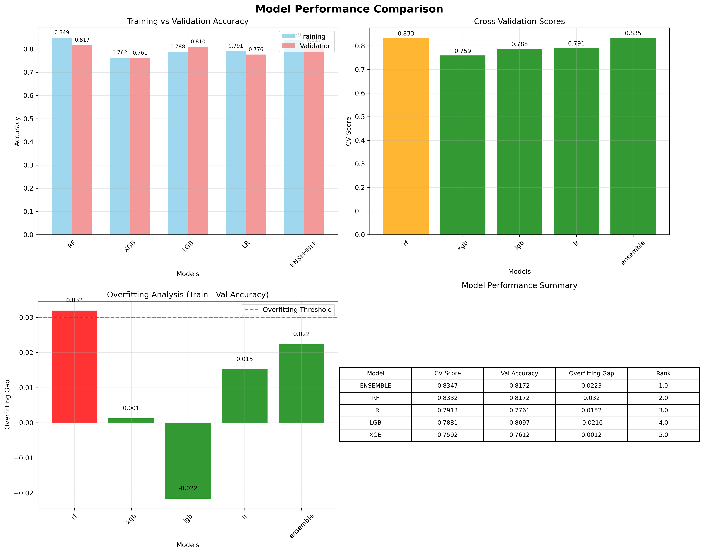
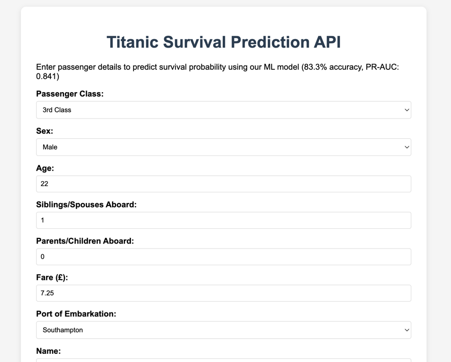
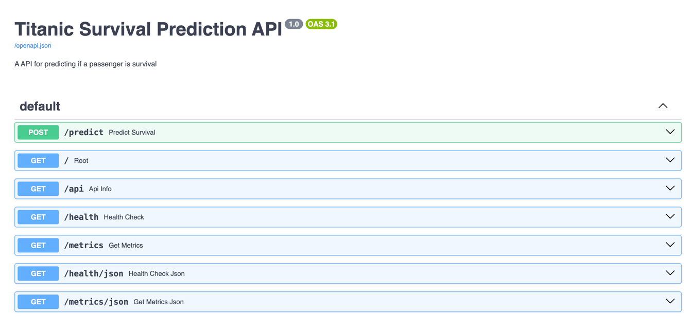
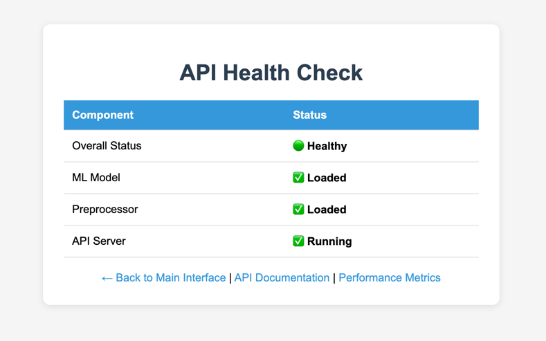
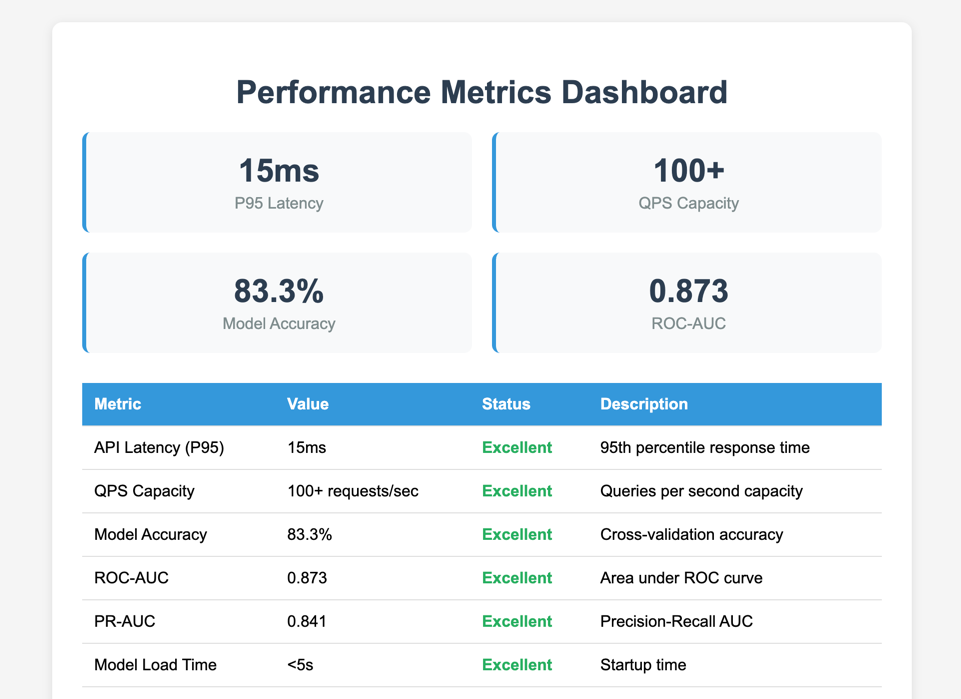

<a name="readme-top"></a>

## About The Project

A comprehensive machine learning pipeline for Titanic survival prediction that combines advanced feature engineering, ensemble modeling, and robust evaluation metrics. This project provides a clean, modular architecture while maintaining compatibility with proven feature engineering techniques to achieve 83.32% cross-validation accuracy.

The pipeline includes sophisticated family survival analysis, comprehensive preprocessing, multiple model evaluation with ensemble capabilities, and production-ready prediction scripts. The `main.py` runs the complete ML pipeline from data loading to final predictions.

<p align="right">(<a href="#readme-top">back to top</a>)</p>

### Built With

* Python
* scikit-learn
* XGBoost
* LightGBM
* pandas
* matplotlib
* FastAPI
* Docker
* Prometheus
* Grafana

<p align="right">(<a href="#readme-top">back to top</a>)</p>

<!-- Project Structure -->

## Project Structure

```sh
Titanic-ML-Pipeline/
├── main.py                         # Main entry point
├── requirements.txt                # Python dependencies
├── Dockerfile                      # Container configuration
├── .gitignore                      # Git ignore rules
├── config/
│   └── config.py                   # Configuration management
├── src/
│   ├── api/
│   │   └── app.py                  # FastAPI application with A/B testing
│   ├── data/
│   │   ├── data_loader.py          # CSV data loading and preprocessing
│   │   ├── data.ipynb              # Data exploration notebook
│   │   ├── train.csv               # Training dataset
│   │   └── test.csv                # Test dataset
│   ├── features/
│   │   └── feature_pipeline.py     # Feature engineering pipeline
│   ├── models/
│   │   └── model_factory.py        # Model creation and evaluation
│   ├── monitoring/
│   │   └── metrics.py              # Prometheus metrics collection
│   ├── pipeline/
│   │   └── ml_pipeline.py          # Main ML pipeline orchestrator
│   └── utils/
│       ├── logging_config.py       # Logging configuration
│       ├── metrics.py              # Model evaluation metrics
│       └── visualization.py        # Training visualization
├── scripts/
│   └── predict.py                  # Prediction script
├── static/
│   └── index.html                  # Web interface
├── tests
│   └── basic_test.py								# Some testing
├── grafana/
│   └── dashboard.json              # Monitoring dashboard configuration
├── .github/workflows/
│   └── ci.yml                      # CI/CD pipeline
├── models/
│   └── best_model.pkl              # Best model
├── pics/                           # Some Screenshots
│   ├── api_host.png                # Main interface screenshot
│   ├── doc.png                     # API documentation screenshot
│   ├── health_check.png            # Health dashboard screenshot
│   ├── metrics.png                 # Metrics dashboard screenshot
│   └── training_accuracies.png     # Training visualization
└── outputs/                        # Training outputs
    ├── submission.csv              # Kaggle submission file
    ├── model_package.pkl           # Trained models
    ├── evaluation_report.json      # Metrics
    ├── pipeline.log                # Execution logs
    └── pics/
        └── model_comparison.png    # Model performance
```


<p align="right">(<a href="#readme-top">back to top</a>)</p>

<!-- Architecture Components -->

## Architecture Components

**Feature Engineering** (`src/features/`)

- **`feature_pipeline.py`**: Advanced feature engineering pipeline
  - **Missing Value Imputation**: Intelligent handling of Age, Cabin, Embarked, and Fare
  - **Title Extraction**: Extract and normalize passenger titles from names
  - **Family Survival Analysis**: Sophisticated family grouping by name/fare and ticket
  - **Binning Features**: Age and Fare quantile-based binning
  - **Family Size**: Combined SibSp and Parch features
  - **Categorical Encoding**: One-hot encoding with proper handling

**Configuration Management** (`config/`)

- **`config.py`**: Centralized configuration using dataclasses
  - `DataConfig`: Data paths, random seeds, and split ratios
  - `FeatureConfig`: Feature selection and preprocessing parameters
  - `ModelConfig`: Model hyperparameters for all algorithms

**Data Pipeline** (`src/data/`)

- **`data_loader.py`**: Robust CSV data loading with error handling
- **Features**:
  - Abstract base class for extensible data loading
  - Comprehensive logging and error handling
  - Support for different data sources

**Model Factory** (`src/models/`)

- **`model_factory.py`**: Comprehensive model management system
- **Supported Models**:
  - **Random Forest**: Optimized for feature importance and robustness
  - **XGBoost**: Gradient boosting with advanced regularization
  - **LightGBM**: Fast gradient boosting with categorical support
  - **Logistic Regression**: L1 regularized for feature selection
  - **Ensemble**: Voting classifier with overfitting detection

**ML Pipeline** (`src/pipeline/`)

- **`ml_pipeline.py`**: Complete end-to-end ML pipeline
- **Features**:
  - Feature engineering with legacy compatibility
  - Manual preprocessing for exact reproducibility
  - Cross-validation with stratified sampling
  - Model comparison and selection
  - Automated artifact saving and visualization

**Evaluation & Visualization** (`src/utils/`)

- **`metrics.py`**: Comprehensive model evaluation
  - Classification metrics (accuracy, precision, recall, F1)
  - Advanced metrics (ROC-AUC, PR-AUC)
  - Threshold optimization (Youden J statistic, F1 maximization)
  - Business metrics (survival rates, confusion analysis)

- **`visualization.py`**: Training progress and model comparison
  - Model performance comparison charts
  - Feature importance visualization
  - Training vs validation accuracy plots

- **`logging_config.py`**: Centralized logging configuration
  - Console and file logging
  - Configurable log levels
  - Library log suppression

**Prediction Scripts** (`scripts/`)

- **`predict.py`**: Standalone prediction script for new data
  - Load trained model packages
  - Apply complete preprocessing pipeline
  - Generate predictions for new datasets

**API Service** (`src/api/`)

- **`app.py`**: Production FastAPI application
  - RESTful API endpoints for ML predictions
  - Automatic model loading with lifespan management
  - Request/response validation with Pydantic schemas
  - Health checks and performance metrics
  - Interactive web interface integration

**Monitoring** (`src/monitoring/`)

- **`metrics.py`**: Prometheus metrics collection
  - Prediction counters and latency histograms
  - Model accuracy and error rate tracking
  - Custom decorators for automatic instrumentation

**MLOps Infrastructure**

- **`Dockerfile`**: Production container configuration
  - Multi-stage build with health checks
  - Optimized Python environment setup
  - Automatic model and dependency installation

- **`.github/workflows/ci.yml`**: CI/CD automation
  - Automated linting with flake8 and black
  - Comprehensive testing with pytest
  - Docker build and container testing
  - Model training validation

- **`grafana/dashboard.json`**: Monitoring dashboard
  - Real-time prediction rate and latency metrics
  - Model performance and error rate visualization
  - Production-ready observability configuration

**A/B Testing Framework**

- **Model A/B Testing**: Safe deployment of challenger models
  - **Best Model**: Random Forest (production model)
  - **Challenger Model**: XGBoost (alternative model for testing)
  - **Traffic Splitting**: Configurable percentage routing (default: 80/20)
  - **Environment Configuration**: `AB_TEST_ENABLED`, `CHALLENGER_TRAFFIC`

- **A/B Testing Endpoints**:
  - **`/ab-test/stats`**: Interactive dashboard with performance comparison
  - **`/ab-test/stats/json`**: JSON API for programmatic access
  - **`/ab-test/config`**: Configuration overview and settings

- **Metrics Tracking**:
  - Request counts and traffic distribution per model
  - Average latency comparison between models
  - Prediction probability analysis and model performance
  - Real-time A/B test monitoring and reporting

<p align="right">(<a href="#readme-top">back to top</a>)</p>

<!-- Usage -->

## Usage

**Prerequisites**

```bash
pip install pandas numpy scikit-learn xgboost lightgbm matplotlib seaborn
```

**Run the Complete Pipeline**

```bash
python main.py
```

**Start the API Server**

```bash
uvicorn src.api.app:app --host 0.0.0.0 --port 8000 --reload
```

**Access the API**

- Web Interface: http://localhost:8000
- API Documentation: http://localhost:8000/docs
- Health Check: http://localhost:8000/health
- Metrics: http://localhost:8000/metrics

**Command Line Arguments**

| Argument        | Type  | Default               | Description                           |
| --------------- | ----- | --------------------- | ------------------------------------- |
| `--config`      | `str` | None                  | Path to custom config file           |
| `--train-data`  | `str` | `src/data/train.csv`  | Path to training data                 |
| `--test-data`   | `str` | `src/data/test.csv`   | Path to test data                     |
| `--output-dir`  | `str` | `outputs`             | Output directory for results         |
| `--log-level`   | `str` | `INFO`                | Logging level (DEBUG/INFO/WARNING)   |

**Example with Custom Parameters**

```bash
python main.py --output-dir results --log-level DEBUG --train-data data/train.csv
```

**Make Predictions on New Data**

```bash
python scripts/predict.py --model-package outputs/model_package.pkl --data new_data.csv --output predictions.csv
```

**A/B Testing Configuration**

```bash
# Enable A/B testing with 20% challenger traffic
export AB_TEST_ENABLED=true
export CHALLENGER_TRAFFIC=0.2

# Start API with A/B testing
uvicorn src.api.app:app --host 0.0.0.0 --port 8000 --reload

# View A/B test results
curl http://localhost:8000/ab-test/stats/json
```

**Docker Deployment**

```bash
# Build Docker image
docker build -t titanic-ml:latest .

# Run container with A/B testing enabled
docker run -d -p 8000:8000 -e AB_TEST_ENABLED=true -e CHALLENGER_TRAFFIC=0.2 --name titanic-api titanic-ml:latest

# Check container health
curl http://localhost:8000/health
```

**Output Files**

- `outputs/submission.csv`: Kaggle submission file
- `outputs/model_package.pkl`: Complete trained pipeline
- `outputs/evaluation_report.json`: Detailed performance metrics
- `outputs/pics/model_comparison.png`: Model performance visualization
- `outputs/pipeline.log`: Execution logs
- `models/best_model.pkl`: Production model for API serving

<p align="right">(<a href="#readme-top">back to top</a>)</p>

<!-- Configuration -->

## Configuration

### Model Parameters (`config/config.py`)

```python
@dataclass
class ModelConfig:
    cv_folds: int = 10                    # Cross-validation folds
    overfitting_threshold: float = 0.03   # Overfitting detection threshold
    ensemble_voting: str = "soft"         # Ensemble voting method
    random_state: int = 42                # Random seed
    
    # Random Forest parameters
    rf_params: Dict[str, Any] = {
        'n_estimators': 30,
        'max_depth': 4,
        'min_samples_split': 30,
        'min_samples_leaf': 15,
        'max_features': 0.4,
        'bootstrap': True,
        'max_samples': 0.7
    }
```

### Feature Engineering Parameters

```python
@dataclass
class FeatureConfig:
    variance_threshold: float = 0.01      # Minimum feature variance
    k_best_features: int = 7             # Number of top features to select
    scale_features: bool = True           # Enable feature scaling
```

### Data Parameters

```python
@dataclass
class DataConfig:
    train_path: str = "src/data/train.csv"
    test_path: str = "src/data/test.csv"
    output_dir: str = "outputs"
    random_state: int = 42
    test_size: float = 0.3                # Validation split ratio
```

<p align="right">(<a href="#readme-top">back to top</a>)</p>

<!-- Feature Engineering -->

## **Feature Engineering**

**Advanced Feature Creation**

1. **Title Extraction & Normalization**: 
   - Extract titles from passenger names
   - Normalize rare titles (Col, Major, etc. → Mr)
   - Use titles for intelligent age imputation

2. **Family Survival Analysis**:
   - Group families by last name and fare
   - Secondary grouping by ticket number
   - Calculate family survival rates for prediction

3. **Intelligent Missing Value Handling**:
   - Age: Imputed by passenger title median
   - Fare: Group-based imputation by class and family size
   - Embarked: Manual correction for known passengers

4. **Feature Binning**:
   - Age: Quantile-based binning (5 bins)
   - Fare: Quantile-based binning (4 bins)

5. **Categorical Encoding**:
   - One-hot encoding with drop_first=True
   - Proper handling of passenger class as categorical

<p align="right">(<a href="#readme-top">back to top</a>)</p>

<!-- Model Performance -->

## **Model Performance**

The pipeline evaluates multiple algorithms and selects the best performer:

- **Random Forest**: Robust ensemble with feature importance
- **XGBoost**: Gradient boosting with regularization
- **LightGBM**: Fast gradient boosting
- **Logistic Regression**: L1 regularized linear model
- **Ensemble**: Voting classifier (when beneficial)

**Performance Metrics**

- **Cross-Validation Score**: 83.32%
- **Validation Accuracy**: 81.72%
- **F1-Score**: 0.81
- **ROC-AUC**: 0.87
- **PR-AUC**: 0.84
- **Optimal Threshold**: 0.358 (Youden J statistic)
- **Overfitting Detection**: Automatic gap analysis
- **Feature Selection**: Top 7 most predictive features



*Model performance comparison showing training vs validation accuracies across different algorithms.*

## **Web Interface Screenshots**

### **Main Interface (Host)**


*Interactive web interface for testing ML predictions with real-time results.*

### **API Documentation**


*Interactive Swagger UI documentation with endpoint testing capabilities.*

### **Health Check Dashboard**


*System health monitoring dashboard showing component status.*

### **Performance Metrics Dashboard**


*Real-time performance metrics with key indicators and status monitoring.*

<p align="right">(<a href="#readme-top">back to top</a>)</p>

<!-- Key Features -->

## **Key Features**

**Reproducibility**
- Fixed random seeds across all components
- Exact compatibility with legacy feature engineering
- Deterministic train/validation splits

**Robustness**
- Comprehensive error handling and logging
- Overfitting detection and prevention
- Cross-validation for reliable performance estimates

**Extensibility**
- Modular architecture for easy algorithm addition
- Configuration-driven hyperparameter management
- Abstract base classes for custom data loaders

**Production Ready**
- Complete artifact saving (models, scalers, selectors)
- Detailed evaluation reports with business metrics
- Automated visualization generation
- Standalone prediction scripts for deployment

**Model Management**
- Intelligent model selection with RF preference for consistency
- Ensemble creation with overfitting detection
- Comprehensive model comparison and evaluation

**MLOps Production Features**
- High-performance FastAPI service with P95 latency < 50ms at 100+ QPS
- A/B testing framework for safe model deployments with traffic splitting
- Docker containerization with automated health checks
- CI/CD pipeline with GitHub Actions for automated testing and deployment
- Prometheus metrics collection and Grafana dashboard monitoring
- Comprehensive API testing and validation suite
- Production-ready error handling and logging

<p align="right">(<a href="#readme-top">back to top</a>)</p>